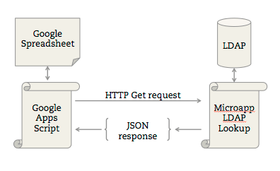
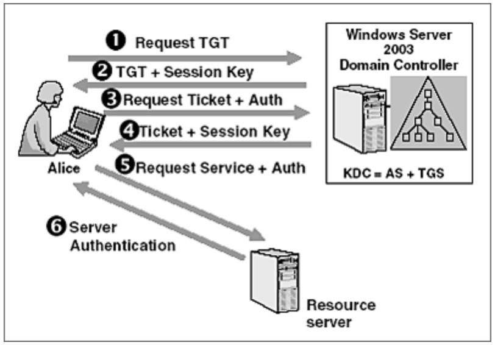
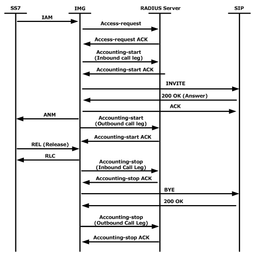

# Authentication
Different ways to bypass authentication
## Answer
- Brute-force
- SQLi
- Forget Password
- Forced Browsing
- Parameter Modification: isAdmin
- Session Identifier Prediction

## Defination:
Authentication is the process of determining whether a user should be allowed access to a system. A human can be authenticated to a machine based on any of the following methods:
i. Something you know: Password
ii. Something you have: ATM card
iii. Something you are:: Biometric
iv. Two-Factor Authentication: 1 and 2

## Authentication Protocols
i. Authentication using symmetric keys-
ii. Authentication using public keys-
iii. Authentication using Session keys-

# SAML/OAuth2.0
SAML
Are you familiar with SAML/ Oauth2.0? Have you come across it? 
## Answer
SAML (Security Assertion Mark-up Language) is an umbrella standard that covers federation, identity management and single sign-on (SSO). In contrast, the OAuth (Open Authorisation) is a standard for, colour me not surprised, authorisation of resources. Unlike SAML, it doesn’t deal with authentication.
OAuth2.0 is a protocol to provide temporary access to a resource
### The SAML workflow
* An end user clicks on the “Login” button on a file sharing service at example.com. The file sharing service at example.com is the Service Provider, and the end user is the Client.
* To authenticate the user, example.com constructs a SAML Authentication Request, signs and optionally encrypts it, and sends it directly to the IdP.
* The Service Provider redirects the Client’s browser to the IdP for authentication.
* The IdP verifies the received SAML Authentication Request and if valid, presents a login form for the end user to enter his username and password.
* Once the Client has successfully logged in, the IdP generates a SAML Assertion (also known as a SAML Token), which includes the user identity (such as the username entered before), and sends it directly to the Service Provider.
* The IdP redirects the Client back to the Service Provider
* The Service Provider verifies the SAML Assertion, extracts the user identity from it, assigns correct permissions for the Client and then logs him in to the service

## The OAuth workflow
Critically, OAuth doesn’t assume that the Client is a web browser.

The example workflow proceeds now as follows:

* An end user clicks on the “Login” button on a file sharing service at example.com. The file sharing service at example.com is the Resource Server, and the end user is the Client.
* The Resource Server presents the Client with an Authorisation Grant, and redirects the Client to the Authorisation Server
* The Client requests an Access Token from the Authorisation Server using the Authorisation Grant Code
* The Client logs in to the Authorisation Server, and if the code is valid, the Client gets an Access Token that can be used request a protected resource from the Resource Server
* After receiving a request for a protected resource with an accompanying Access Token, the Resource Server verifies the validity of the token directly with the Authorisation Server
* If the token was valid, the Authorisation Server sends information about the Client to the Resource Server

## LDAP
LDAP (Lightweight Directory Access Protocol) is a software protocol for enabling anyone to locate organizations, individuals, and other resources such as files and devices in a network, whether on the public Internet or a corporate intranet.

On a functional level, LDAP works by binding an LDAP user to an LDAP server. The client sends an operation request that asks for a particular set of information, such as user login credentials or other organizational data. The LDAP server then processes the query based on its internal language, communicates with directory services if needed, and responds. When the client receives the response, it unbinds from the server and processes the data accordingly.

## Kerberos
Kerberos is a network authentication protocol. It is designed to provide strong authentication for client/server applications by using secret-key cryptography. A free implementation of this protocol is available from the Massachusetts Institute of Technology. Kerberos is available in many commercial products as well.

Here are the most basic steps taken to authenticate in a Kerberized environment.

* Client requests an authentication ticket (TGT) from the Key Distribution Center (KDC).
* The KDC verifies the credentials and sends back an encrypted TGT and session key.
* Client requests to access an application on a server. A ticket request for the application server gets sent to the KDC which consists of the client’s TGT and an authenticator.
* The KDC returns a ticket and a session key to the user.
* The ticket is sent to the application server. Once the ticket and authenticator have been received, the server can authenticate the client.
* The server replies to the client with another authenticator. On receiving this authenticator, the client can authenticate the server.

## RADIUS
Remote Authentication Dial-In User Service (RADIUS) is a networking protocol that provides centralized Authentication, Authorization, and Accounting (AAA or Triple A) management for users who connect and use a network service.

RADIUS authentication begins when the user requests access to a network resource through the Remote Access Server (RAS). The user enters a username and a password, which are encrypted by the RADIUS server before being sent through the authentication process. 

Then the RADIUS server checks the accuracy of the information by employing authentication schemes to verify the data. This is done by comparing the user-provided information against a locally stored database or referring to external sources such as Active Directory servers.

The RADIUS server will then respond by accepting, challenging or rejecting the user. Individual users may be granted restricted access without affecting other users. In the case of a challenge, the RADIUS server requests additional information from the user to verify their user ID - which may be a PIN or a secondary password. In the case of a reject, the user is unconditionally denied all access to the RADIUS protocol.

## OAuth 2.0 vs OpenID Connect vs SAML
Remember that it isn’t a question of which structure an organization should use, but rather of when each one should be deployed. A strong identity solution will use these three structures to achieve different ends, depending on the kind of operations an enterprise needs to protect. Their use cases are as follows:

OAuth 2.0: If you’ve ever signed up to a new application and agreed to let it automatically source new contacts via Facebook or your phone contacts, then you’ve likely used OAuth 2.0. This standard provides secure delegated access. That means an application can take actions or access resources from a server on behalf of the user, without them having to share their credentials. It does this by allowing the identity provider (IdP) to issue tokens to third-party applications with the user’s approval.

OpenID Connect: If you’ve used your Google to sign in to applications like YouTube, or Facebook to log into an online shopping cart, then you’re familiar with this authentication option. OpenID Connect is an open standard that organizations use to authenticate users. IdPs use this so that users can sign in to the IdP, and then access other websites and apps without having to log in or share their sign-in information. 

SAML: You’ve more likely experienced SAML authentication in action in the work environment. For example, it enables you to log into your corporate intranet or IdP and then access numerous additional services, such as Salesforce, Box, or Workday, without having to re-enter your credentials. SAML is an XML-based standard for exchanging authentication and authorization data between IdPs and service providers to verify the user’s identity and permissions, then grant or deny their access to services.

Enterprises rely on web frameworks and protocols like OAuth 2.0, OpenID, and SAML to bring structure and security to federated identity. Knowing when to use each is a key step towards protecting your organization’s data from the ground up.