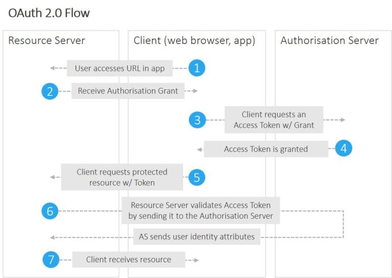
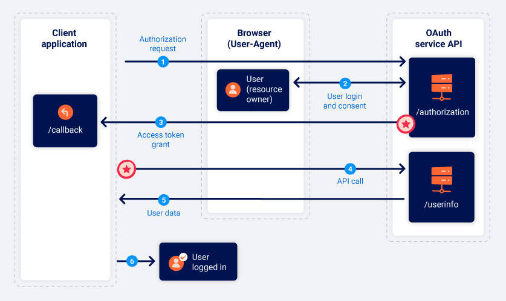

## OAUth

OAuth is an open standard for access delegation, commonly used as a way for Internet users to grant websites or applications access to their information on other websites but without giving them the passwords.

The example workflow proceeds now as follows:

* An end user clicks on the “Login” button on a file sharing service at example.com. The file sharing service at example.com is the Resource Server, and the end user is the Client.
* The Resource Server presents the Client with an Authorisation Grant, and redirects the Client to the Authorisation Server
* The Client requests an Access Token from the Authorisation Server using the Authorisation Grant Code
* The Client logs in to the Authorisation Server, and if the code is valid, the Client gets an Access Token that can be used request a protected resource from the Resource Server
* After receiving a request for a protected resource with an accompanying Access Token, the Resource Server verifies the validity of the token directly with the Authorisation Server
* If the token was valid, the Authorisation Server sends information about the Client to the Resource Server

## Vuln

Vulnerabilities can arise in the client application's implementation of OAuth as well as in the configuration of the OAuth service itself. 

* Insecure Storage of Client Secret at  Client
    * Look for harcoded client secrets, in JS maybe
* Insecure Storage of OAuth 2.0 Access and Refresh Tokens at  Client
* OAuth 2.0 Redirect URI Not  Validated (Potentails CSRF to steal code and token)

https://portswigger.net/web-security/oauth

## Tokens
### Access Token
    * Used to obtain access to a protected resource(Issue by Auth Server). Has a limited lifetime.

### Refresh token
    * Used to obtain a new access token when access token has expired

## OAuth Grant types:
### Client Credential Grant type(Machine to Machine)
    * Resource owner not involved
    * Server side application
    * Cron job
    * Client request Access Token by sending basic Auth -> Auth server, Auth server issues an access token
### Auth Code Grant Type
* 3rd Party application
    * Clinet will not see the username and password
    * Resource owner consent is required
    * Application with sign-in with google
    * Requires redirections

### Resource Owner-Password Crdential-Grant Type
* Fir st Party application
    * Client fully trusted with user creds
    * Apps build by same company
    * Client gets user creds from the user through UI, Client get an access token using the creds, Auth server issues an access token(Optionally a refresh token)
### Implicit grant type(Similar to Auth code)
* Single page application
    * Simplified version of Auth code
    * Single page UI only application

    *  the client application will often submit this data to the server in a POST request and then assign the user a session cookie, effectively logging them in. This request is roughly equivalent to the form submission request that might be sent as part of a classic, password-based login. However, in this scenario, the server does not have any secrets or passwords to compare with the submitted data, which means that it is implicitly trusted.