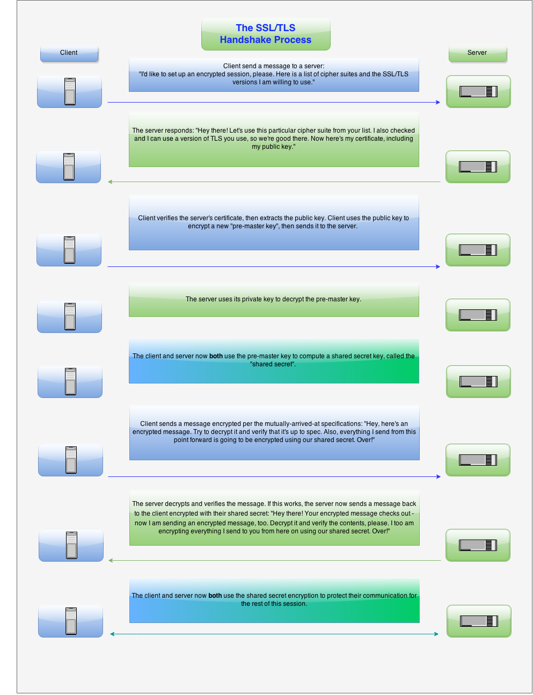

SSL (Secure Socket Layer) and TLS (Transport Layer Security) are popular cryptographic protocols that are used in  web communications. SSL was the predecessor of TLS

## Attacks
### SSL Stripping
"[SSL stripping] takes advantage of the way most users come to SSL websites. The majority of visitors connect to a website’s page that redirects through a 302 redirect, or they arrive on an SSL page via a link from a non-SSL site. If the victim wants, for instance, to buy a product and types the URL www.buyme.com in the address bar, the browser connects to the attacker machine and waits for a response from the server. In an SSL Strip, the attacker, in turn, forwards the victim’s request to the online shop’s server and receives the secure HTTPS payment page...
 

At this point, the attacker has complete control over the secure payment page. He downgrades it from HTTPS to HTTP and sends it back to the victim’s browser. The browser is now redirected to http://www.buyme.com. From now onward, all the victim’s data will be transferred in plain text format, and the attacker will be able to intercept it. Meanwhile, the website’s server will think that it has successfully established the secure connection, which indeed it has—but with the attacker’s machine, not the victim’s."

### Man-in-the-Middle
Successful MITM attacks gain the trust of communicating parties by impersonating a trusted website and eavesdropping on secure conversations. Access to SSL/TLS keys and certificates facilitates MITM attacks, and unsecured or lightly protected wireless access points are often exploited for entry.

There are several ways a bad actor can break the trust SSL/TLS establishes and launch a MITM attack. For example, a website’s server key could be stolen, allowing the attacker to appear as the server. In some cases, the issuing Certificate Authority (CA) is compromised and the root key is stolen, so criminals can generate their own certificates signed by the stolen root key.
 

MITM can also result from a client’s failure to validate the certificate against trusted CAs, or when a client is compromised and a fake CA is injected into the client trusted root authority. In many MITM attacks, malware performs this action to redirect users to fake banking web sites, where sensitive information can be easily stolen.

### POODLE
 takes advantage of two factors. The first factor is the fact that some servers/clients still support SSL 3.0 for interoperability and compatibility with legacy systems. The second factor is a vulnerability that exists in SSL 3.0, which is related to block padding. 

 The SSL 3.0 vulnerability is in the Cipher Block Chaining (CBC) mode. Block ciphers require blocks of fixed length. If data in the last block is not a multiple of the block size, extra space is filled by padding. The server ignores the content of padding. It only checks if padding length is correct and verifies the Message Authentication Code (MAC) of the plaintext. That means that the server cannot verify if anyone modified the padding content.

An attacker can decipher an encrypted block by modifying padding bytes and watching the server response. It takes a maximum of 256 SSL 3.0 requests to decrypt a single byte.

Some TLS 1.0/1.1 implementations are also vulnerable to POODLE because they accept an incorrect padding structure after decryption.

### BEAST
It applies to SSL 3.0 and TLS 1.0 so it affects browsers that support TLS 1.0 or earlier protocols. An attacker can decrypt data exchanged between two parties by taking advantage of a vulnerability in the implementation of the Cipher Block Chaining (CBC) mode in TLS 1.0

This is a client-side attack that uses the man-in-the-middle technique. The attacker uses MITM to inject packets into the TLS stream. This allows them to guess the Initialization Vector (IV) used with the injected message and then simply compare the results to the ones of the block that they want to decrypt.

### CRIME 
The Compression Ratio Info-leak Made Easy (CRIME) vulnerability affects TLS compression. The compression method is included in the Client Hello message and it is optional. You can establish a connection without compression. Compression was introduced to SSL/TLS to reduce bandwidth. DEFLATE is the most common compression algorithm used

One of the main techniques used by compression algorithms is to replace repeated byte sequences with a pointer to the first instance of that sequence. The bigger the sequences that are repeated, the higher the compression ratio.

Let’s assume that the attacker wants to get a victim’s cookie. They know that the targeted website (examplebank.com) creates a cookie for the session named adm. The attacker knows that the DEFLATE compression method replaces repeated bytes. Therefore, the attacker injects Cookie:adm=0 into the victim’s cookie. The server will append only 0 to the compressed response because Cookie:adm= is already sent in the victim’s cookie, so it is repeated.

All that the attacker must do is to inject different characters and then monitor the size of the response. If the response is shorter than the initial one, the injected character is contained in the cookie value and so it was compressed. If the character is not in the cookie value, the response will be longer.

### BREACH
The Browser Reconnaissance and Exfiltration via Adaptive Compression of Hypertext (BREACH) vulnerability is very similar to CRIME but BREACH targets HTTP compression, not TLS compression.

### Heartbleed
Heartbleed was a critical vulnerability that was found in the heartbeat extension of the popular OpenSSL library. This extension is used to keep a connection alive as long as both parties are still there. The Heartbleed vulnerability is registered in the NIST NVD database as CVE-2014-0160.

The client sends a heartbeat message to the server with a payload that contains data and the size of the data (and padding). The server must respond with the same heartbeat request, containing the data and the size of data that the client sent.
