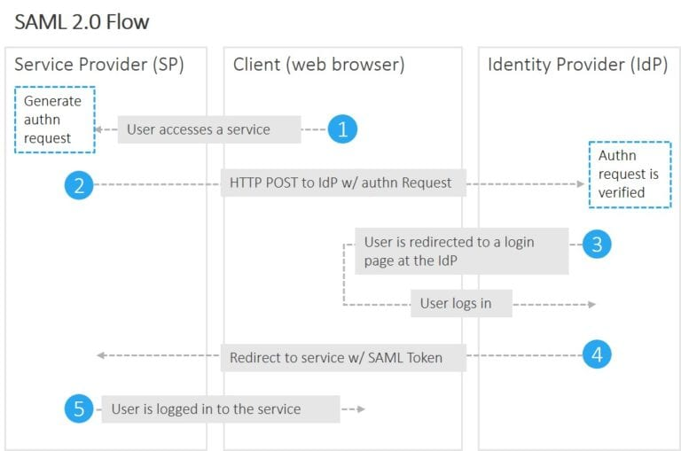

# Background
What’s your background, education, and how long have you been working at Cigital/Synopsys? When did you join GIS?
What types of assessments do you work on in GIS and are you training for any others?
Do you have any certifications or interest in future certifications?
Is this interview for AEH/ MEH or Mobile assessments? 
What is your opinion on using security QA? 
Have you worked on Web Services assessments? 
Why web application testing?
Favorite burp extension
Cool finding you’ve found.

# CORS
Are you familiar with CORS? Can you explain it? 
o	Which is more dangerous: Access-Control-Allow-Origin: * with Allow-Credentials true OR Access-Control-Allow-Origin reflects value of Origin header and Allow-Credentials set to true
## Answer
When JavaScript code attempts to send an XMLHttpRequest to an origin different from the current page, the browser will check whether the target origin allows this interaction according to the configured CORS policy.
Modern browsers add "Origin" headers for cross‐origin requests. The Origin header tells the target application the protocol, domain, and port associated with the JavaScript code that triggered this request.
The target server can then provide instructions to the browser regarding whether or not response data should be made available to the JavaScript code that made the request. If the CORS access control rules from the server are not met, the browser prevents response content from this origin from being available to the calling code. An example of this is when the Access-Control-Allow-Origin response header is not set or doesn't match the value of the Origin request header.
Note: Some requests (e.g., use of custom headers) require the browser to issue a pre-flight request (using the OPTIONS method) to check if the server allows such cross-domain requests before they are even sent.
### Answer2
Fortunately, from a security perspective, the use of the wildcard is restricted in the specification as you cannot combine the wildcard with the cross-origin transfer of credentials (authentication, cookies or client-side certificates). Consequently, a cross-domain server response of the form:

Access-Control-Allow-Origin: *
Access-Control-Allow-Credentials: true

is not permitted as this would be dangerously insecure, exposing any authenticated content on the target site to everyone.

### Scenario:
You have credents of a user, why would you still want to perform CSRF attack? 
CORS can be used to perform attacks in the internal networks.

# HSTS
Explain the HSTS header 
o	How and where is the HSTS header set and used? (and a few more in-depth questions)
Explain to app team why HTST not enforced is bad when they disabled http port
## Answer
When HSTS is enabled, the webserver sends the special HTTP response header called "Strict-Transport-Security" to the client. This header includes the max-age attribute, which specifies a duration of time in seconds. Optionally, the directive 'includeSubdomains' can be included to indicate that this policy should apply to all sub-domains as well. After a browser receives this header over a secure HTTPS connection (without any certificate errors), the browser makes new requests to the application over secure HTTPS connections for the duration of time specified in the header. Any links to the server over insecure HTTP connections are automatically rewritten to HTTPS before the request is made. HSTS prevents a user from ignoring certificate errors, as it prevents the user from connecting to a website with an invalid certificate.

Applications that do not utilize the "HTTP Strict-Transport-Security" policy are more susceptible to man-in-the-middle attacks via SSL stripping, which occurs when an attacker transparently downgrades a victim's communication with the server from HTTPS to HTTP. Once this is accomplished, the attacker gains the ability to view and potentially modify the victim's traffic, exposing sensitive information, and gaining access to unauthorized functionality.

# Deserialization
Deserialization attacks
Are you familiar with Deserialization attacks? 
o	In general, if you say you’re not familiar with an attack, they’ll ask how you’ll learn about it so that you can apply it on your tests
## Answer
Deserialization attacks can occer when deserializing data from untrusted source.
Serialization is the process of converting a data structure or object state in memory into a format fit to be transmitted over a network or stored for later use. This serialized data can later be deserialized, i.e. read and reconstructed, into a memory object. The serialized data contain an object's state (e.g., data), and for some programming languages, it may also contain the actual code associated with the serialized object

# HTTP request smuggling
HTTP request smuggling attacks
The application is vulnerable to an HTTP Request Smuggling attack since the HTTP request is parsed and interpreted differently by the front-end (web) server and back-end (application) server.

Consider the below request from a client to a front-end server:
```
POST /query HTTP /1.1
Host: example.com 
Content-Type: application/x-www-form-URL encoded 
Content-Length: 13
Transfer-Encoding: chunked

0

ATTACK
```
In this example, if the front-end server parses the HTTP request based on the Content-Length header, it sends all data up to the end of 'ATTACK' as part of this request to the back-end. However, if the back-end server parses the request using the Transfer-Encoding header, it processes the first chunk with message length 0 as part of this request and considers it as the end of a message body. This leaves the 'ATTACK' payload as unprocessed, and the back-end server treats this left-over message as the start of the next request.

# SAML/OAuth2.0
SAML
Are you familiar with SAML/ Oauth2.0? Have you come across it? 
## Answer
SAML (Security Assertion Mark-up Language) is an umbrella standard that covers federation, identity management and single sign-on (SSO). In contrast, the OAuth (Open Authorisation) is a standard for, colour me not surprised, authorisation of resources. Unlike SAML, it doesn’t deal with authentication.
OAuth2.0 is a protocol to provide temporary access to a resource
### The SAML workflow
* An end user clicks on the “Login” button on a file sharing service at example.com. The file sharing service at example.com is the Service Provider, and the end user is the Client.
* To authenticate the user, example.com constructs a SAML Authentication Request, signs and optionally encrypts it, and sends it directly to the IdP.
* The Service Provider redirects the Client’s browser to the IdP for authentication.
* The IdP verifies the received SAML Authentication Request and if valid, presents a login form for the end user to enter his username and password.
* Once the Client has successfully logged in, the IdP generates a SAML Assertion (also known as a SAML Token), which includes the user identity (such as the username entered before), and sends it directly to the Service Provider.
* The IdP redirects the Client back to the Service Provider
* The Service Provider verifies the SAML Assertion, extracts the user identity from it, assigns correct permissions for the Client and then logs him in to the service


## The OAuth workflow
Critically, OAuth doesn’t assume that the Client is a web browser.

The example workflow proceeds now as follows:

* An end user clicks on the “Login” button on a file sharing service at example.com. The file sharing service at example.com is the Resource Server, and the end user is the Client.
* The Resource Server presents the Client with an Authorisation Grant, and redirects the Client to the Authorisation Server
* The Client requests an Access Token from the Authorisation Server using the Authorisation Grant Code
* The Client logs in to the Authorisation Server, and if the code is valid, the Client gets an Access Token that can be used request a protected resource from the Resource Server
* After receiving a request for a protected resource with an accompanying Access Token, the Resource Server verifies the validity of the token directly with the Authorisation Server
* If the token was valid, the Authorisation Server sends information about the Client to the Resource Server


# Authentication
Different ways to bypass authentication
## Answer
- Brute-force
- SQLi
- Forget Password
- Forced Browsing
- Parameter Modification: isAdmin
- Session Identifier Prediction

# DOS
Define DOS attacks for web applications? How would you identify it without causing considerable damage?
## Answer
The Denial of Service (DoS) attack is focused on making a resource (site, application, server) unavailable for the purpose it was designed.

# XML
Are you familiar with XXE (XML External Entity) attacks? 
*	How would you test for it? 
*	How would you test for an XXE attack vs a XML Entity Expansion (Billion Laughs) attack?
## Answer
XML External Entity attack occurs when the XML input containing a reference to an external entity is processed by an insecurely configured XML parser. 
XML parsers can provide a feature enabling external entities to be processed at run-time which can enable attackers to retrieve files from the local filesystem.
* Inject tags and observe how the server is handling the input(look for XML errors)
Contract payload and send
```
<?xml version="1.0"? >
<!DOCTYPE foo [  
   <!ELEMENT foo ANY >
   <!ENTITY xxe SYSTEM "file:///etc/passwd"  >]>
<foo>&xxe;</ foo>
```
Observe the response to look for signs of successful inclusion of the referenced file, such as the following:
* Inject tags and observe how the server is handling the input(look for XML errors)
Contract payload and send
```
<?xml version="1.0"? >
<!DOCTYPE xee  [
<!E LEMENT xee (# PCDATA)>
<!ENT ITY laugh0 "ha" >
<!ENTITY laugh1 "&laugh0;&laugh0;" >
<!ENTITY laugh 2 "&laugh1;&laugh1;" >
<!ENTITY laugh 3 "&laugh2;&laugh2;" >
<!ENTITY laugh 4 "&laugh3;&laugh3;" >
<!ENTITY laugh 5 "&laugh4;&laugh4;" >
<!ENTITY laugh 6 "&laugh5;&laugh5;" >
<!ENTITY laugh 7 "&laugh6;&laugh6;" >
<!ENTITY laugh 8 "&laugh7;&laugh7;" >
<!ENTITY laugh 9 "&laugh8;&laugh8;" >
<!ENTITY laugh "&laugh9;&laugh9;" >
 ]>
<xee>&laugh;</ xee>
```
Observe the response to see there is any delay in the response time or other sign of impact . 

# CSRF
Describe CSRF and its mitigation to a developer and also to a business executive.
To mitigate CSRF, can we put a unique token on each page or put a static token throughout the application? What are the strengths and weaknesses of these approaches?
Should CSRF tokens be generated per session or per transaction? 
Explain CSRF – what are some assumptions
## Answer
A Cross-Site Request Forgery (CSRF) vulnerability occurs when the application fails to ensure that requests received by the server originated from pages served by the application.

For example, an attacker creates a malicious website and convinces an authenticated user to visit the malicious site, such as via phishing. The malicious website can then initiate an HTTP request for a state-changing operation to the vulnerable application with data supplied by the attacker. The HTTP request causes the victim's browser to automatically send the user's session cookie along with the request. The application then processes the request as though the victim had initiated the request from one of the application's pages.

# SQLi
Why do we demonstrate exploits for findings like SQL Injection, instead of just reporting the issue to the app team?
Do we exploit SQL injection or just report the finding once we confirm that it is a true positive?
Scenario: What if Burp reports a SQLi finding and the payload contains the collaborator payload. Burp shows that there is at least a DNS look up picked up by the collaborator server. How would you go about triaging and testing this finding?
## Answer
Any user-supplied data containing SQL syntax inserted into the static query will be interpreted and executed. This leaves the application vulnerable to SQL injection since an attacker can inject SQL query syntax that intentionally alters the target query's structure.


# Web services
What are the two different types of web services and how do you test each one?
o	What is the difference between SOAP and REST?
How would you distinguish between a GET and POST request given that you don’t know the HTTP method used? Can GET requests also have content in the body? 
Webservice – Dif between SOAP and REST
Can GET requests have a body?
## Answer
### Soap
* Simple Object access protocol
* Protocol
* XML
* Standardization
* security
* Soap only uses POST requests
Good for financial transaction(Asynchronous processing, Stateful operation)

### Rest
* Representational start transter
* Architec style
* XML, JSON,
* High Performance
* Scalability
* Flaxibility
* A Restful service would use the normal HTTP verbs of GET, POST, PUT and DELETE for working with the required components
Great for running multi ops(Limited connection, coding simplicity, caching)

# HEE
Explain dif between hashing, encoding, encryption – security benefits
o	Does encryption help with integrity?
Explain Sha1 Hashing algorithm security risk to non-technical person
## Answer
Encoding: The purpose of encoding is to transform data so that it can be properly (and safely) consumed by a different type of system.

Encryption:The purpose of encryption is to transform data in order to keep it secret from others. The goal is to ensure the data cannot be consumed by anyone other than the intended recipient

Hashing: Hashing serves the purpose of ensuring integrity, i.e. making it so that if something is changed you can know that it’s changed. Technically, hashing takes arbitrary input and produce a fixed-length string that has the following attributes:

* The same input will always produce the same output.
* Multiple disparate inputs should not produce the same output.
* It should not be possible to go from the output to the input.
* Any modification of a given input should result in drastic change to the hash.

Obfuscation: The purpose of obfuscation is to make something harder to understand, usually for the purposes of making it more difficult to attack or to copy.

## SHA1
A hash function such as SHA-1 is used to calculate an alphanumeric string that serves as the cryptographic representation of a file or a piece of data. This is called a digest and can serve as a digital signature. It is supposed to be unique and non-reversible.

If a weakness is found in a hash function that allows for two files to have the same digest, the function is considered cryptographically broken, because digital fingerprints generated with it can be forged and cannot be trusted. Attackers could, for example, create a rogue software update that would be accepted and executed by an update mechanism that validates updates by checking digital signatures.

# XSS
Explain XSS
## Answer
Cross site scripting  is a type of security vulnarability in web applications. XSS attacks enables attackers to inject client-side script into web pages viewed by othe users. It can be used by an attacker to bypass access-control, such as same-origin policy. An attacker might be abl;e to steal session cookies, access tokens, user credentials or msensitive data of a user.

It is classified into two types:

Persistant
* Stored XSS

Non-persistant
* Dom-based XSS
* Reflected XSS

# Engage
Do you follow any blogs? podcasts?
Describe a cool vulnerability you found 
How do you keep yourself updated on cybersecurity news? Did you hear of any cool/new findings and try it out on your assessments? What is something that you picked up recently from the resources you look at? 
How to keep up with security news and continued training.
